<p align="center">
  
</p>

<h1 align="center">PVE Manager</h1>

<p align="center">
  <b>面向中国用户的 Proxmox VE 现代化 Web 管理面板</b>
</p>

<p align="center">
  
  
  
  
  
  
  
</p>

---

## 项目简介

Proxmox VE (PVE) 原生 Web UI 基于 ExtJS，界面老旧且对中文用户不够友好。**PVE Manager** 旨在构建一个现代化、轻量化、功能丰富的 PVE Web 管理面板，提供完整的虚拟化运维体验。

### 核心价值

- **现代化 UI/UX** — Vue 3 + Element Plus，响应式设计，暗色模式支持
- **完善的中文化** — 全界面中文本地化，符合国内运维习惯
- **AI 智能运维** — 内置 AI 助手，支持故障诊断、运维建议、报告生成
- **应用商店** — 一键部署 Nginx、MySQL、Redis、GitLab 等 15+ 常用服务
- **轻量部署** — SQLite 嵌入式数据库，零外部依赖，Docker 一键启动

## 截图预览

<p align="center">
  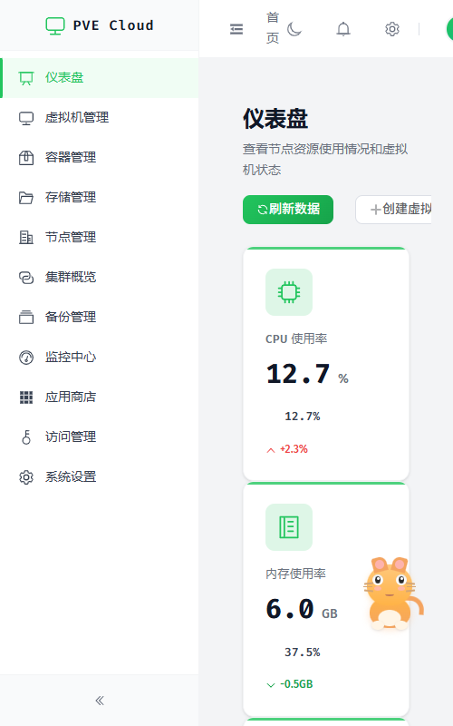
</p>

<table>
  <tr>
    <td align="center"><b>虚拟机管理</b></td>
    <td align="center"><b>容器管理</b></td>
  </tr>
  <tr>
    <td>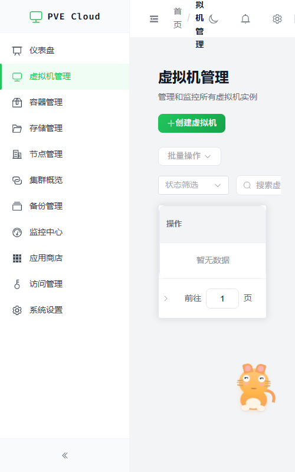</td>
    <td>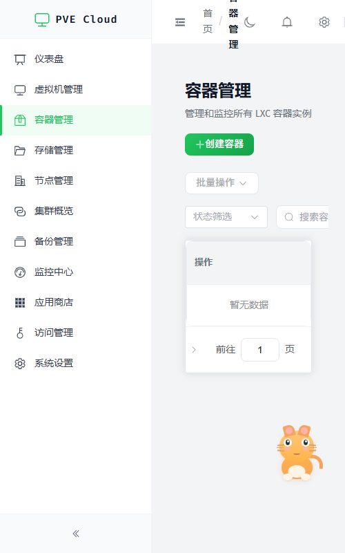</td>
  </tr>
  <tr>
    <td align="center"><b>应用商店</b></td>
    <td align="center"><b>AI 智能对话</b></td>
  </tr>
  <tr>
    <td>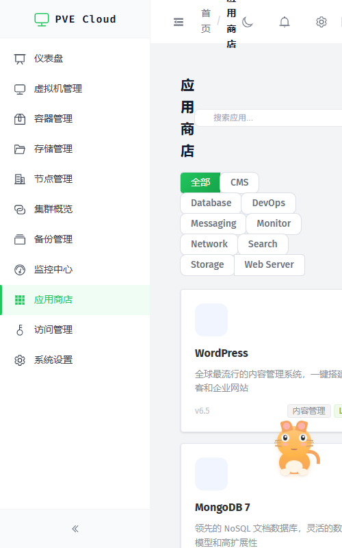</td>
    <td>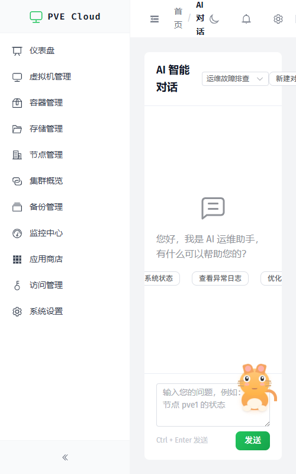</td>
  </tr>
  <tr>
    <td align="center"><b>监控中心</b></td>
    <td align="center"><b>访问管理</b></td>
  </tr>
  <tr>
    <td>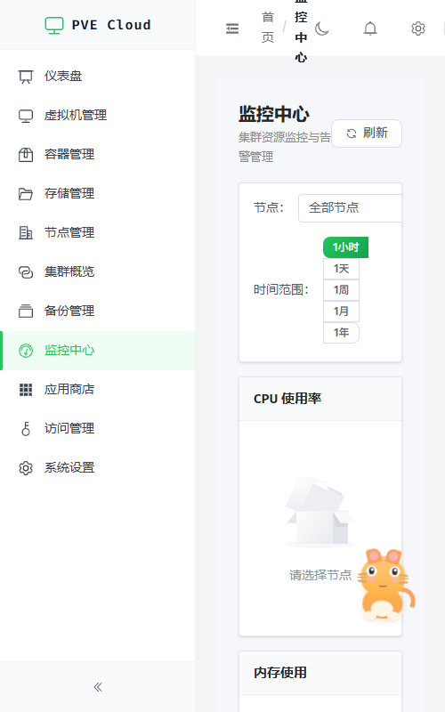</td>
    <td>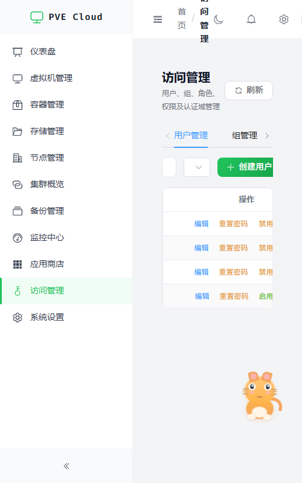</td>
  </tr>
</table>

<details>
<summary>📸 查看更多截图</summary>

<table>
  <tr>
    <td align="center"><b>存储管理</b></td>
    <td align="center"><b>节点管理</b></td>
  </tr>
  <tr>
    <td>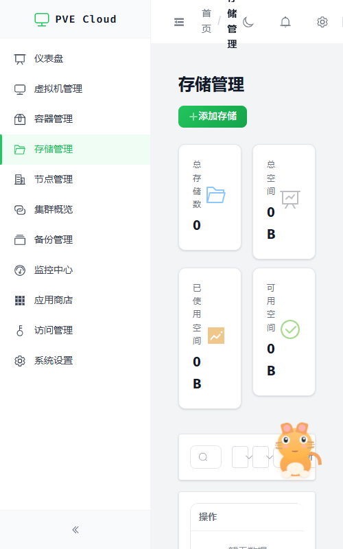</td>
    <td>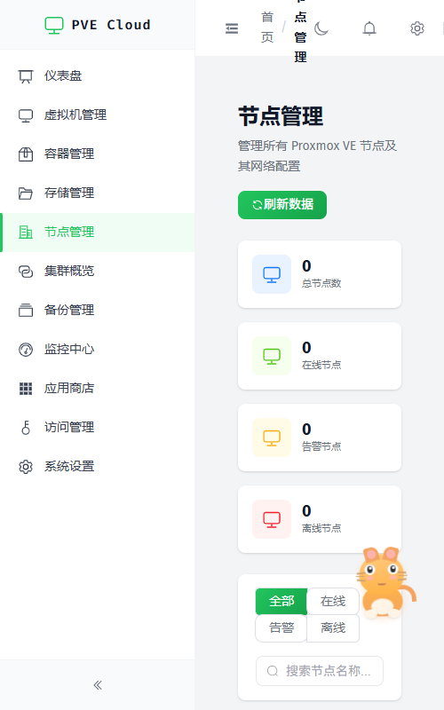</td>
  </tr>
  <tr>
    <td align="center"><b>集群概览</b></td>
    <td align="center"><b>备份管理</b></td>
  </tr>
  <tr>
    <td>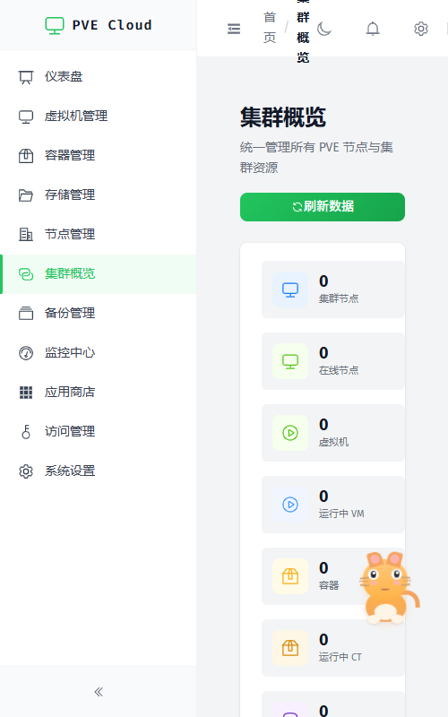</td>
    <td>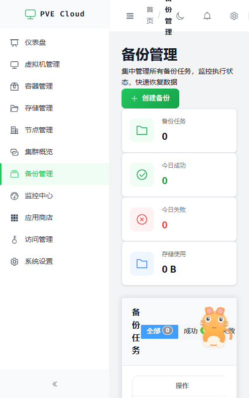</td>
  </tr>
  <tr>
    <td align="center"><b>部署管理</b></td>
    <td align="center"><b>系统设置</b></td>
  </tr>
  <tr>
    <td>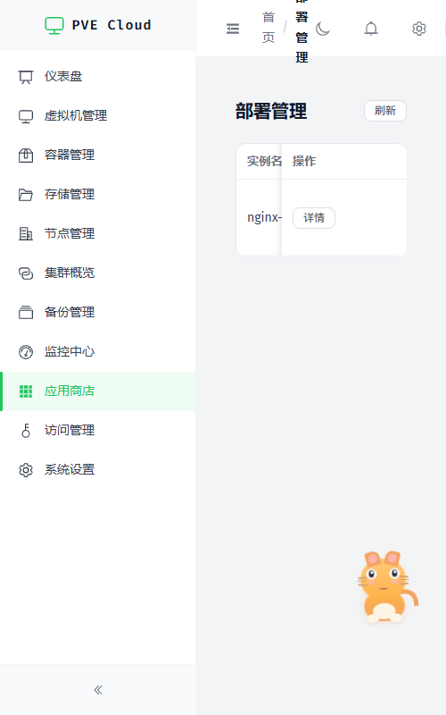</td>
    <td>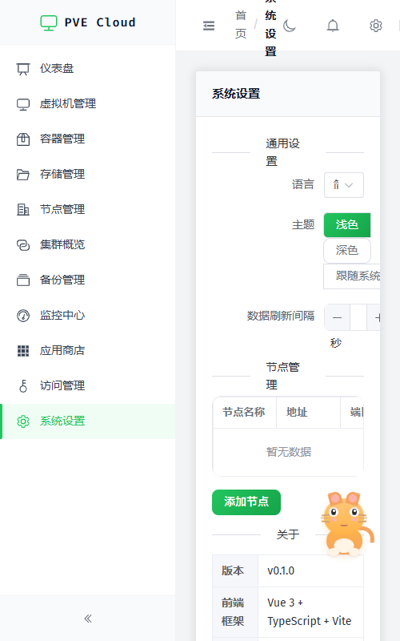</td>
  </tr>
</table>

</details>

## 功能特性

### 🖥️ 虚拟化管理
- QEMU 虚拟机全生命周期管理（创建/启动/停止/迁移/删除）
- LXC 容器全生命周期管理
- noVNC 远程控制台 & XTerm.js 终端
- 快照管理与回滚
- 批量操作支持
- 资源使用率实时监控

### 📊 监控与告警
- CPU/内存/磁盘/网络实时监控图表
- 多时间范围查看（1小时~1年）
- 节点资源对比
- 自定义告警规则
- 集群资源概览

### 🤖 AI 智能运维
- 浮动宠物猫助手，随时唤起对话
- 支持接入 OpenAI / Claude / Ollama 等大模型
- 故障诊断与修复建议
- 运维报告自动生成
- 快捷操作按钮（检查状态/查看日志/优化建议）

### 🏪 应用商店
- 15+ 内置应用模板（Nginx、MySQL、Redis、Docker、GitLab 等）
- 一键部署 LXC/QEMU 实例
- 部署进度实时跟踪
- 自定义应用模板导入
- 应用分类筛选与搜索

### 🔐 访问管理
- 用户管理（创建/编辑/禁用/删除）
- 组管理 & 角色管理
- 权限管理（RBAC）
- 认证域配置（PAM/PVE）
- 审计日志

### 💾 存储与备份
- 存储池管理（状态/容量/内容类型）
- 备份任务创建与调度
- 备份历史与恢复
- 集群存储概览

### ⚙️ 系统设置
- 中英文切换
- 暗色/浅色主题
- 数据刷新间隔配置
- 多节点管理
- 版本信息展示

## 快速开始

### Docker 一键部署（推荐）

```bash
docker compose -f docker/docker-compose.yml up -d --build
```

访问 `http://localhost:8088` 即可使用。

### 从源码构建

**环境要求：**
- Go 1.21+
- Node.js 18+
- Git

**启动后端：**

```bash
cd backend
go run cmd/server/main.go
```

后端服务默认运行在 `http://localhost:8080`

**启动前端：**

```bash
cd frontend
npm install
npm run dev
```

前端开发服务器运行在 `http://localhost:8088`

### 开发模式

设置环境变量跳过 PVE 认证，使用模拟数据：

```bash
# Linux/macOS
export PVE_DEV_MODE=true

# Windows PowerShell
$env:PVE_DEV_MODE="true"
```

### 配置说明

首次运行后端会自动生成 `config.yaml`：

```yaml
server:
  port: 8080
  mode: debug

pve:
  host: 192.168.1.100
  port: 8006
  verify_ssl: false

ai:
  provider: openai       # openai / claude / ollama
  api_key: ""
  model: gpt-4o-mini
  base_url: ""
```

支持环境变量覆盖：`PVE_DEV_MODE`、`PVE_HOST`、`PVE_PORT`、`AI_API_KEY`

## 技术架构

```
┌─────────────────────────────────────────────────────┐
│                    浏览器                            │
│              Vue 3 + Element Plus                    │
│         Pinia + Vue Router + ECharts                │
├─────────────────────────────────────────────────────┤
│                    Go 后端                           │
│              Gin + GORM + SQLite                     │
│         JWT Auth + PVE API Proxy                    │
│         noVNC Proxy + AI Service                    │
├─────────────────────────────────────────────────────┤
│                 Proxmox VE API                       │
│           REST API (Port 8006)                      │
│         QEMU / LXC / Storage / Network              │
└─────────────────────────────────────────────────────┘
```

| 层级 | 技术 | 说明 |
|------|------|------|
| 前端 | Vue 3 + TypeScript + Vite | 现代化 SPA，按需加载 |
| UI 框架 | Element Plus | 企业级组件库 |
| 状态管理 | Pinia | 轻量级响应式 Store |
| 图表 | ECharts | 丰富的监控图表 |
| 后端 | Go + Gin | 高性能 API 网关 |
| ORM | GORM | 数据库操作 |
| 数据库 | SQLite | 嵌入式零配置 |
| 认证 | JWT + AES | 安全的凭据管理 |
| 控制台 | noVNC + XTerm.js | 远程操作 |
| AI | OpenAI / Claude / Ollama | 智能运维 |

## 项目结构

```
pve_webui/
├── backend/                  # Go 后端服务
│   ├── cmd/server/           # 程序入口 & 路由注册
│   ├── internal/
│   │   ├── client/pve/       # PVE REST API 客户端
│   │   ├── client/llm/       # LLM 适配层（OpenAI/Claude/Ollama）
│   │   ├── handler/          # HTTP 处理器
│   │   ├── service/          # 业务逻辑层
│   │   ├── model/            # 数据模型
│   │   ├── repository/       # 数据访问层
│   │   ├── database/         # 数据库初始化
│   │   ├── config/           # 配置管理
│   │   └── middleware/       # 中间件
│   ├── pkg/crypto/           # 加密工具包
│   └── data/                 # SQLite 数据文件
├── frontend/                 # Vue 3 前端
│   ├── src/
│   │   ├── api/              # API 请求封装
│   │   ├── views/            # 页面组件
│   │   │   ├── dashboard/    # 仪表盘
│   │   │   ├── qemu/         # 虚拟机管理
│   │   │   ├── lxc/          # 容器管理
│   │   │   ├── storage/      # 存储管理
│   │   │   ├── node/         # 节点管理
│   │   │   ├── cluster/      # 集群概览
│   │   │   ├── backup/       # 备份管理
│   │   │   ├── monitor/      # 监控中心
│   │   │   ├── app-store/    # 应用商店
│   │   │   ├── ai/           # AI 智能助手
│   │   │   ├── access/       # 访问管理
│   │   │   ├── settings/     # 系统设置
│   │   │   └── login/        # 登录页
│   │   ├── components/       # 通用组件
│   │   │   ├── ai/           # AI 浮动宠物猫
│   │   │   └── common/       # 侧边栏/头部等
│   │   ├── stores/           # Pinia 状态管理
│   │   ├── router/           # 路由配置
│   │   └── utils/            # 工具函数
│   └── ...
├── docker/                   # Docker 部署配置
│   ├── Dockerfile
│   ├── docker-compose.yml
│   └── nginx.conf
└── docs/                     # 文档 & 截图
    └── images/
```

## 开发路线图

| 版本 | 内容 | 状态 |
|------|------|------|
| v0.1 | 基础架构 + JWT 认证 + 仪表盘 | ✅ 已完成 |
| v0.2 | 虚拟机/容器全生命周期管理 | ✅ 已完成 |
| v0.3 | noVNC 控制台 + 快照 + 存储管理 | ✅ 已完成 |
| v0.4 | AI 智能运维 + 应用商店 + 访问管理 | ✅ 已完成 |
| v0.5 | 监控告警 + 备份管理 + 集群高级功能 | ✅ 已完成 |
| v1.0 | 性能优化 + 国际化 + 正式发布 | 🚧 进行中 |

## 参与贡献

欢迎贡献代码！请遵循以下流程：

1. Fork 本仓库
2. 创建功能分支 (`git checkout -b feature/amazing-feature`)
3. 提交更改 (`git commit -m 'feat: 添加某某功能'`)
4. 推送分支 (`git push origin feature/amazing-feature`)
5. 提交 Pull Request

### 提交规范

| 前缀 | 说明 |
|------|------|
| `feat:` | 新功能 |
| `fix:` | 修复 Bug |
| `docs:` | 文档更新 |
| `style:` | 代码格式调整 |
| `refactor:` | 代码重构 |
| `perf:` | 性能优化 |
| `test:` | 测试相关 |

## 致谢

- [Proxmox VE](https://www.proxmox.com/) — 强大的开源虚拟化平台
- [Vue.js](https://vuejs.org/) — 渐进式 JavaScript 框架
- [Go](https://go.dev/) — 高性能编程语言
- [Element Plus](https://element-plus.org/) — Vue 3 组件库
- [noVNC](https://novnc.com/) — HTML5 VNC 客户端

## 许可证

[MIT](LICENSE) © 2026 PVE Manager Contributors
